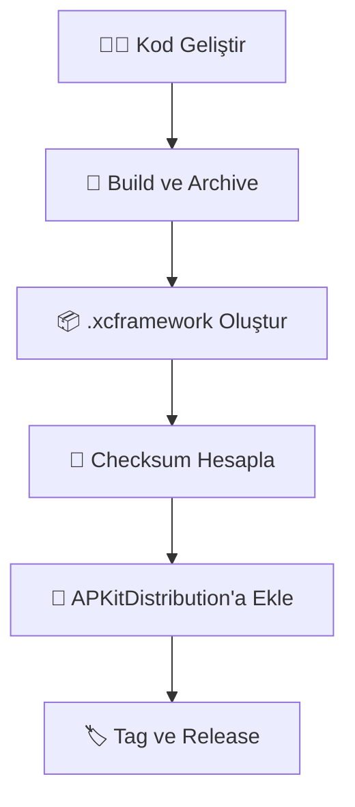

# 🚀 APKitDistribution

**APKitDistribution**, Abdurrahman Polat tarafından geliştirilen SDK bileşenlerinin (📦 `APThemeKit`, 📦 `APRouterKit` vb.) merkezi olarak build edilip dağıtıldığı repository’dir.  
Bu yapı, iOS ve macOS platformları için **XCFamework build**, **checksum hesaplama** ve **Swift Package Manager (SPM)** dağıtımını optimize eder.  

---

## 🧩 İçerikte Neler Var?

| Kit | Platform | Açıklama |
|-----|-----------|----------|
| **APThemeKit** | iOS + macOS | Ortak tema, renk, tipografi ve UI bileşenleri sağlar 🎨 |
| **APRouterKit** | iOS only | SwiftUI tabanlı yönlendirme (Navigation / Deep Link) sistemi 🚦 |
| **APKitDistribution** | Cross | Tüm SDK’ların derlenip `.xcframework` formatında dağıtıldığı ana yapı 📁 |

---

## ⚙️ SDK Güncelleme / Build Süreci

Herhangi bir SDK güncellemesi veya yeni versiyon build işlemi öncesi, **local ortam temizliği** yapılmalıdır.  
Bu işlem SwiftPM cache ve Xcode derived data’yı sıfırlar 🧹

### 🧼 1. Cache Temizliği

Terminalde aşağıdaki komutları çalıştırın:

```bash
# 🔧 Swift Package Manager cache temizleme
rm -rf ~/Library/Caches/org.swift.swiftpm

# 🧱 Xcode Derived Data temizleme
rm -rf ~/Library/Developer/Xcode/DerivedData/*
```

💡 **Not:** Bu işlem, eski build dosyalarının yeni checksum hesaplamalarını etkilememesi için kritik öneme sahiptir.

---

## 🧰 2. SDK Build Süreci

Her SDK için build işlemi otomatik olarak **GitHub Actions / release.yml** dosyası tarafından yönetilir.  
Yine de local build almak istersen aşağıdaki adımları izleyebilirsin:

```bash
# 🔨 APThemeKit için iOS + macOS build
xcodebuild archive   -scheme APThemeKit   -destination "generic/platform=iOS"   -archivePath "./Build/iOS/APThemeKit.xcarchive"   SKIP_INSTALL=NO BUILD_LIBRARY_FOR_DISTRIBUTION=YES

xcodebuild archive   -scheme APThemeKit   -destination "generic/platform=macOS"   -archivePath "./Build/macOS/APThemeKit.xcarchive"   SKIP_INSTALL=NO BUILD_LIBRARY_FOR_DISTRIBUTION=YES

# 🧩 .xcframework oluşturma
xcodebuild -create-xcframework   -framework ./Build/iOS/APThemeKit.xcarchive/Products/Library/Frameworks/APThemeKit.framework   -framework ./Build/macOS/APThemeKit.xcarchive/Products/Library/Frameworks/APThemeKit.framework   -output ./XCFrameworks/APThemeKit.xcframework
```

---

## 📦 3. APKitDistribution Güncelleme

Yeni bir versiyon build ettikten sonra aşağıdaki adımlar izlenmelidir:

1. `XCFrameworks/` klasörü altındaki yeni `.xcframework` dosyasını ekle.  
2. Checksum değerini hesapla:
   ```bash
   swift package compute-checksum XCFrameworks/APThemeKit.zip
   ```
3. `Package.swift` içinde ilgili URL ve checksum değerini güncelle.  
4. Commit ve tag işlemini tamamla:
   ```bash
   git add .
   git commit -m "Update APThemeKit to vX.Y.Z"
   git tag vX.Y.Z
   git push origin main --tags
   ```

---

## 🌐 4. Swift Package Manager (SPM) Entegrasyonu

Projene `APKitDistribution`’ı SPM üzerinden eklemek için:

1. **Xcode > File > Add Packages...**
2. Repository URL’sini gir:
   ```
   https://github.com/AbdurrahmanPolat/APKitDistribution.git
   ```
3. İstediğin versiyonu seç (örn. `v1.2.0`)

📦 Artık projen içinde:
```swift
import APThemeKit
import APRouterKit
```
olarak kullanabilirsin.  

---

## 💬 Katkıda Bulunmak

Her katkı 🧠 değerli!  
- Yeni bir komponent veya geliştirme fikrin varsa `feature/` branch açabilirsin.  
- Pull Request açmadan önce lütfen `swiftlint` kurallarına ve proje kod stiline uyumlu olduğundan emin ol.

---

## 🧭 Özet Akış



---

## ❤️ Teşekkürler

Bu altyapı, **modern Swift SDK dağıtımında** şeffaflık, hız ve sürdürülebilirlik sağlamayı amaçlar.  
Destek ve katkılarınız için teşekkürler!  
> — *Developed with passion by* **Abdurrahman Polat**
